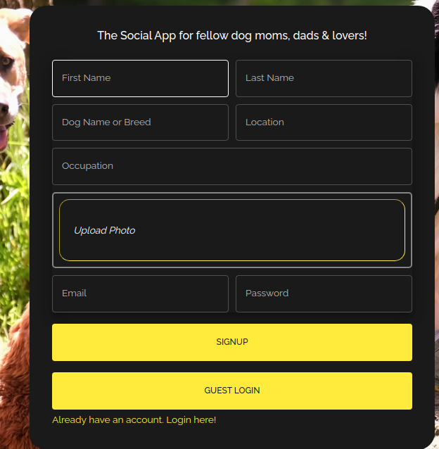
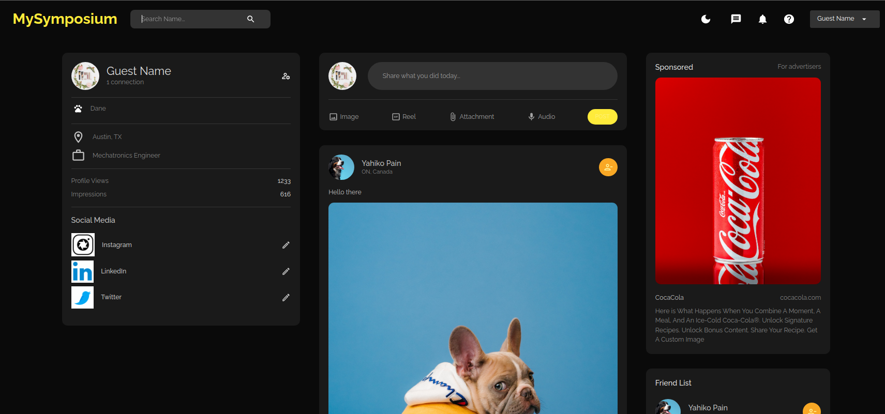

# MySymposium
Full Stack MERN Social Media Application for dog owners 
(Facebook Clone)


- Quick Guest login available for recruiters


## Client

### Login/Signup & HomePage



```
Import attachments with React Dropzone
```

```
React, Material UI  & Redux for state-management.
```


## Server
- Light/ Dark Mode
- User authentication & authorization 
- Supports CRUD functionality (Add friends, share posts, like & comment)

Server-side javascript runtime 
```
- Node 
```

Node route handler
```
- Express
```

Database
```
- MongoDB as NoSQL/Non-relational database to store user information
```

REST API & Production
```
- Deployed on render.com
```

File Structure
```
- Used MVC & best practices for folder organization
```

Cookie creation
```
- Json Web Token to create cookie for user authentication & authorization across UI
- Bcrypt for hashing of passwords
```

Testing/Debugging
```
- POSTMAN API & Node debugger
```


## Challenges

```
- Everything was difficult. As as my first full-stack application, I got stuff plenty of times when creating the back-end.
- POSTMAN, testing with breakpoints & chrome dev tools were a vital part of debugging during this project.
```

# How to Run
1. Download zip
2. npm i
3. Open seperate terminal to run server: nodemon index.js
4. Run client on 2nd terminal: npm run dev

# Deployed Server On Render
https://mysymposium-server.onrender.com/


# Image & User Credits
Images from Unsplash & www.pexels.com
