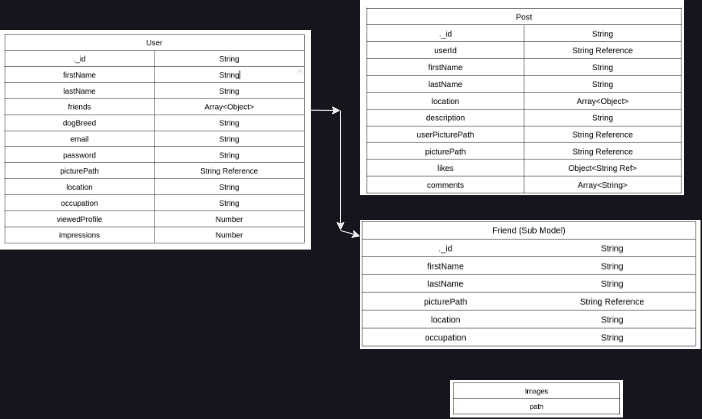

# MySymposium
Full Stack MERN Social Media Application 

# ERD Diagrams

# How to Run
1. Download zip
2. npm i
3. Open seperate terminal to run server: nodemon index.js
4. Run client on 2nd terminal: npm run dev

# Deployed Server On Render
https://mysymposium-server.onrender.com/

# Image & User Credits
Images from Unsplash & www.pexels.com
